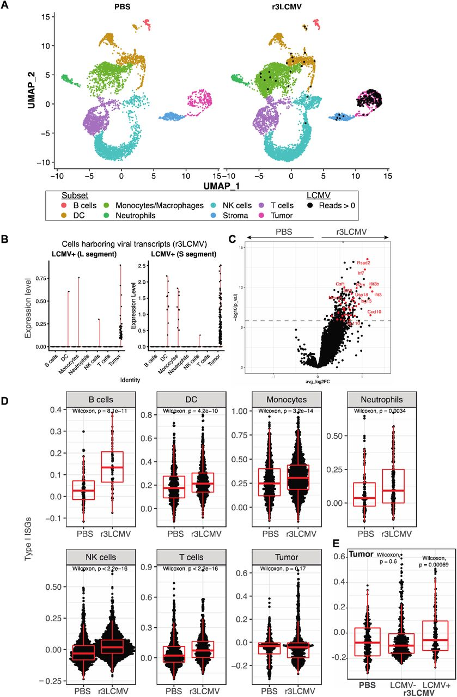

# Penaloza-MacMaster: r3LCVM
R code to reproduce the single-cell analysis of the r3LCMV project  
  

R code [[MD]](code/20231030_PenalozaMacMasterLCMVtumorVax.scrnaseq.md)  
  
input:  
- R3 raw count file [[H5]](input/R3_LCMV.filtered_feature_bc_matrix.h5)
- PBS raw count file [[H5]](input/PBS_LCMV.filtered_feature_bc_matrix.h5)
  
output:  
- Seurat object [RDA](see data release)
