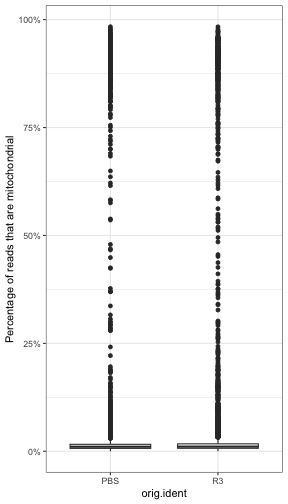
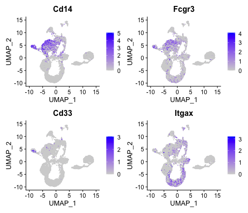
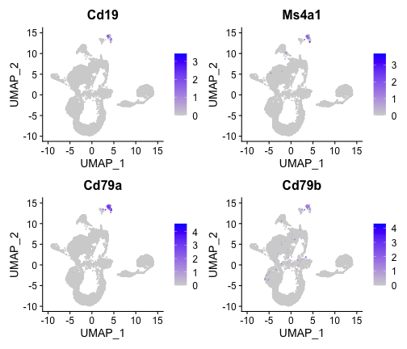
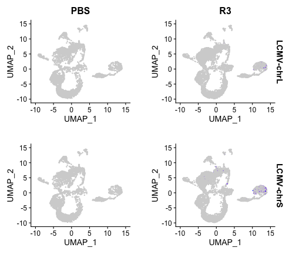
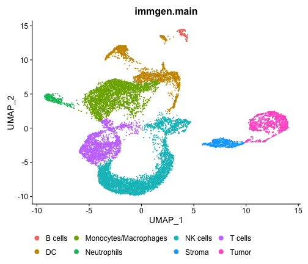
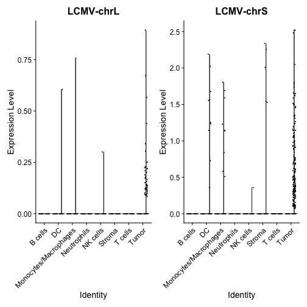
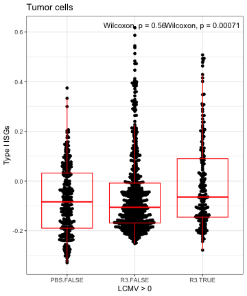

LCMV scRNA-Seq processing
================
Slim FOURATI
2024-06-27

Load required packages

``` r
suppressPackageStartupMessages(library(package = "knitr"))
suppressPackageStartupMessages(library(package = "hdf5r"))
suppressPackageStartupMessages(library(package = "Seurat"))
suppressPackageStartupMessages(library(package = "celldex"))
suppressPackageStartupMessages(library(package = "SingleR"))
suppressPackageStartupMessages(library(package = "BiocParallel"))
suppressPackageStartupMessages(library(package = "biomaRt"))
suppressPackageStartupMessages(library(package = "ggbeeswarm"))
suppressPackageStartupMessages(library(package = "ggpubr"))
suppressPackageStartupMessages(library(package = "ggrepel"))
suppressPackageStartupMessages(library(package = "xlsx"))
suppressPackageStartupMessages(library(package = "tidyverse"))
```

``` r
opts_chunk$set(echo = TRUE, fig.path = "../figure/")
options(readr.show_col_types   = FALSE,
        dplyr.summarise.inform = FALSE)
workDir <- dirname(getwd())
```

``` r
seqFiles <- list.files(path       = file.path(workDir, "input"), 
                      full.names = TRUE,
                      pattern = ".+LCMV.+h5$")
seuratObj <- NULL
for (seqFile in seqFiles) {
    seuratTemp <- Read10X_h5(filename = seqFile)
    sampleId <- gsub(pattern     = "\\..+",
                     replacement = "",
                     basename(seqFile))
    seuratTemp <- CreateSeuratObject(seuratTemp, 
                                     project = sampleId)
    seuratTemp <- RenameCells(seuratTemp,
                              new.names = paste0(sampleId,
                                                 "_",
                                                 colnames(seuratTemp)))
    seuratTemp <- DietSeurat(seuratTemp)

    if (is.null(seuratObj)) {
        seuratObj <- seuratTemp
    } else {
        seuratObj <- merge(x = seuratObj, y = seuratTemp)
    }
}
```

``` r
rm(seuratTemp)
```

# Quality control

Percentage of mitochondrial reads

``` r
ensembl <- useMart(biomart = "ensembl", dataset="mmusculus_gene_ensembl")
gene2chr <- getBM(attributes = c("mgi_symbol", "chromosome_name"), 
                  filters = "mgi_symbol", 
                  values = rownames(seuratObj$RNA), 
                  mart = ensembl)

mito.genes <- filter(gene2chr, chromosome_name %in% "MT") %>%
  .$mgi_symbol

percent.mito <- Matrix::colSums(seuratObj$RNA@counts[mito.genes, ])/
  Matrix::colSums(seuratObj$RNA@counts)

# AddMetaData adds columns to object@meta.data, and is a great place to
seuratObj <- AddMetaData(object   = seuratObj,
                         metadata = percent.mito,
                         col.name = "percent.mito")
```

``` r
ggplot(data    = seuratObj@meta.data,
       mapping = aes(x = orig.ident, y = percent.mito)) +
  geom_boxplot() +
  scale_y_continuous(labels = scales::percent) +
  labs(y = "Percentage of reads that are mitochondrial") +
  theme_bw()
```

<figure>

<figcaption aria-hidden="true">plot of chunk plot-mito</figcaption>
</figure>

Percent of ribosomal reads

``` r
# look at ribosomal genes
ribo.genes <- grep(pattern = "^Rps|^Rpl", 
                   rownames(x = seuratObj$RNA@counts), 
                   value   = TRUE)
percent.ribo <- Matrix::colSums(seuratObj$RNA@counts[ribo.genes, ])/Matrix::colSums(seuratObj$RNA@counts)

# AddMetaData adds columns to object@meta.data, and is a great place to
seuratObj <- AddMetaData(object   = seuratObj,
                         metadata = percent.ribo,
                         col.name = "percent.ribo")
```

``` r
ggplot(data    = seuratObj@meta.data,
       mapping = aes(x = orig.ident, y = percent.ribo)) +
  geom_boxplot() +
  theme_bw()
```

<figure>

<figcaption aria-hidden="true">plot of chunk plot-ribo</figcaption>
</figure>

Number of cell detected

``` r
nbCellDF <- table(seuratObj@meta.data$orig.ident) %>%
  as.data.frame() %>%
  rename(orig.ident                  = Var1,
         `Estimated Number of Cells` = Freq)
meanReadsPerCellDF <- colSums(seuratObj$RNA@counts) %>%
  data.frame(eta = .) %>%
  rownames_to_column() %>%
  mutate(orig.ident = seuratObj@meta.data$orig.ident) %>%
  group_by(orig.ident) %>%
  summarize(`Mean Reads per Cell` = mean(eta))
medianGenesPerCell <- colSums(seuratObj$RNA@counts > 0) %>%
  data.frame(eta = .) %>%
  rownames_to_column() %>%
  mutate(orig.ident = seuratObj@meta.data$orig.ident) %>%
  group_by(orig.ident) %>%
  summarize(`Median Genes per Cell` = median(eta))

plotDF <- merge(x    = nbCellDF,
                y    = meanReadsPerCellDF,
                by   = "orig.ident") %>%
  merge(y  = medianGenesPerCell,
        by = "orig.ident") %>%
  pivot_longer(cols = -orig.ident)

ggplot(data = plotDF,
       mapping = aes(x = orig.ident, y = value)) +
  geom_bar(stat = "identity") +
  facet_grid(rows = ~name, scale = "free", space = "free_x") +
  theme_bw() +
  theme(axis.text.x = element_text(angle = 90, hjust = 1, vjust = 0.5))
```

<div class="figure" style="text-align: left">


<p class="caption">
plot of chunk read-qc-ge
</p>

</div>

``` r
plotDF %>%
  group_by(name) %>%
  summarize(median  = median(value),
            min     = min(value),
            max     = max(value)) %>%
  rename(metric = name) %>%
  kable()
```

| metric                    |   median |      min |      max |
|:--------------------------|---------:|---------:|---------:|
| Estimated Number of Cells |  6595.00 |  5243.00 |  7947.00 |
| Mean Reads per Cell       | 11294.36 | 10698.85 | 11889.88 |
| Median Genes per Cell     |  2110.00 |  2051.00 |  2169.00 |

# Cell annotation

``` r
DefaultAssay(seuratObj) <- "RNA"
seuratObj <- NormalizeData(seuratObj) %>% 
    FindVariableFeatures() %>% 
    ScaleData() %>% 
    RunPCA()

seuratObj <- RunUMAP(seuratObj, dims = 1:10, n.components = 2L) 
```

Expression of canonical markers

``` r
feat1 <- FeaturePlot(object   = seuratObj,
                     features = c("Ptprc", "Tyrp1"),
                     raster   = FALSE)
feat1
```

<div class="figure" style="text-align: left">


<p class="caption">
plot of chunk feature-plot-cd45
</p>

</div>

Ptprc=Cd45; cells clustering on UMAP1 \> 5 are tumors cells (CD45-).
Tyrp1 is a marker of melanocytes.

``` r
feat2 <- FeaturePlot(object   = seuratObj, 
                         features = c("Cd3g", "Cd3g", "Cd3e",
                                        "Cd4", "Cd8a", "Cd8b1"),
                     raster   = FALSE)
feat2
```

<figure>

<figcaption aria-hidden="true">plot of chunk feature-plot-t</figcaption>
</figure>

``` r
feat3 <- FeaturePlot(object = seuratObj,
                     features = c("Cd14",
                                  "Fcgr3",
                                  "Cd33",
                                  "Itgax" #CD11c
                                  ),
  raster = FALSE)
feat3
```

<figure>

<figcaption aria-hidden="true">plot of chunk
feature-plot-immune</figcaption>
</figure>

``` r
feat4 <- FeaturePlot(object = seuratObj,
                     features = c("Cd19",
                                  "Ms4a1", # CD20
                                  "Cd79a",
                                  "Cd79b"),
  raster = FALSE)
feat4
```

<figure>

<figcaption aria-hidden="true">plot of chunk
feature-plot-immune</figcaption>
</figure>

``` r
feat5 <- FeaturePlot(object = seuratObj,
                     features = c("LCMV-chrL", "LCMV-chrS"),
  raster = FALSE,
  split.by = "orig.ident")
feat5
```

<div class="figure" style="text-align: left">


<p class="caption">
plot of chunk feature-plot-lcmv
</p>

</div>

SingleR at the cell levels

``` r
scaledMat <- seuratObj$RNA@data
immgen <- celldex::ImmGenData()
predSubset <- SingleR(test    = scaledMat,
                      ref     = immgen,
                      labels  = immgen$label.main,
                      BPPARAM = MulticoreParam(workers = 7))
seuratObj <- AddMetaData(object   = seuratObj,
                         metadata = predSubset$labels,
                         col.name = "immgen.main")

umap1 <- DimPlot(seuratObj,
reduction  = 'umap',
group.by   = 'immgen.main',
raster     = FALSE) +
theme(legend.position = "bottom",
      legend.key.size = unit(x = 0.1, units = "in"),
      legend.text = element_text(size = 7))
umap1
```

<div class="figure" style="text-align: left">


<p class="caption">
plot of chunk singler
</p>

</div>

SingleR at the cluster level

``` r
seuratObj <- FindNeighbors(seuratObj, reduction = "umap", dims = 1:2)
seuratObj <- FindClusters(seuratObj, resolution = 0.5)
```

``` r
umap2 <- DimPlot(seuratObj,
        reduction  = 'umap', 
        group.by   = 'seurat_clusters',
        raster     = FALSE,
        label = TRUE) + 
  theme(legend.position = "bottom")
umap2
```

<div class="figure" style="text-align: left">


<p class="caption">
plot of chunk umap-cluster
</p>

</div>

``` r
scaledMat <- seuratObj$RNA@data
immgen <- celldex::ImmGenData()
predSubset <- SingleR(test    = scaledMat,
                      ref     = immgen,
                      clusters = seuratObj@meta.data$seurat_clusters,
                      labels  = immgen$label.main,
                      BPPARAM = MulticoreParam(workers = 7))
# correct cluster annotation
immgen.main <- predSubset$pruned.labels[match(seuratObj$seurat_clusters,
                        table = rownames(predSubset))]
immgen.main[seuratObj$seurat_clusters %in% c(12, 15, 27)] <- "Tumor"
immgen.main[seuratObj$seurat_clusters %in% 9] <- "Stroma"
immgen.main[seuratObj$seurat_clusters %in% 25] <- "DC"
immgen.main[seuratObj$seurat_clusters %in% c(3, 4, 8, 10, 13)] <- "Monocytes/Macrophages"
immgen.main[seuratObj$seurat_clusters %in% c(0, 11, 18, 21)] <- "T cells"
immgen.main[seuratObj$seurat_clusters %in% c(5, 6, 16, 22)] <- "NK cells"

if ("immgen.main" %in% colnames(seuratObj@meta.data)) {
  seuratObj$immgen.main <- NULL
}
seuratObj <- AddMetaData(object   = seuratObj,
                         metadata = immgen.main,
                         col.name = "immgen.main")
```

``` r
umap3 <- DimPlot(seuratObj,
        reduction  = 'umap', 
        group.by   = 'immgen.main',
        raster     = FALSE) + 
  theme(legend.position = "bottom")
umap3
```

<figure>

<figcaption aria-hidden="true">plot of chunk
umap-singler-cluster</figcaption>
</figure>

``` r
seuratObj$orig.ident <- gsub(pattern     = "_LCMV",
                             replacement = "",
                             seuratObj$orig.ident)
umap4 <- DimPlot(seuratObj,
                 reduction  = 'umap',
                 group.by   = 'immgen.main',
                 split.by   = 'orig.ident',
                 raster     = FALSE) +
  theme(legend.position = "bottom")
umap4 +
  geom_point(data = umap4$data[(Matrix::colSums(seuratObj$RNA@counts[c("LCMV-chrL", "LCMV-chrS"), ]) >= 1), ],
             mapping = aes(x = UMAP_1, y = UMAP_2), cex = 0.5) +
  labs(title = NULL)
```

<figure>

<figcaption aria-hidden="true">plot of chunk umap-by-treat</figcaption>
</figure>

``` r
save(seuratObj, file = file.path(workDir, "output/lcmv.seuratObj.RData"))
```

# LCMV reads

``` r
vln2 <- VlnPlot(object = seuratObj,
          features = c("LCMV-chrL", "LCMV-chrS"),
        group.by= "immgen.main",
        split.by = "orig.ident")
vln2
```

 LCMV reads are only
detected in the R3 samples (right) and mostly in tumor cells and then in
some monocytes and DCs.

# Type I ISGs expression

``` r
isgLS <- fgsea:::gmtPathways("/Users/iew5629/Desktop/Projects/Utils/MSigDB/h.all.v2023.1.Hs.symbols.gmt") %>%
  .[["HALLMARK_INTERFERON_ALPHA_RESPONSE"]]

human <- useMart(biomart = "ensembl", 
                 dataset = "hsapiens_gene_ensembl",
                 host    = "https://dec2021.archive.ensembl.org/")
mouse <- useMart(biomart = "ensembl", 
                 dataset="mmusculus_gene_ensembl",
                 host    = "https://dec2021.archive.ensembl.org/")
human2mouse <- getLDS(mart = human, attributes = "hgnc_symbol", 
                      filters = "hgnc_symbol", values = isgLS, 
                      attributesL = "mgi_symbol", martL = mouse)
seuratObj <- AddModuleScore(seuratObj, features = list(isg = human2mouse$MGI.symbol),
                            name = "isg")
```

``` r
FeaturePlot(seuratObj, 
            features = "isg1",
            split.by = "orig.ident")
```

<figure>

<figcaption aria-hidden="true">plot of chunk umap-is</figcaption>
</figure>

``` r
vln1 <- VlnPlot(object = seuratObj,
          features = "isg1",
        group.by= "orig.ident",
        split.by = "immgen.main")

vln1$data %>%
  ggplot(mapping = aes(x = ident, y = isg1)) +
  geom_beeswarm(size = 0.5, cex = 0.75) +
  geom_boxplot(outlier.color = "transparent", fill = "transparent", color = "red") +
  labs(x = NULL, y = "Type I ISGs") +
  stat_compare_means(cex = 2) +
  facet_wrap(facets = ~split, scale = "free_y", nrow = 2) +
  theme_bw()
```

<figure>

<figcaption aria-hidden="true">plot of chunk boxplot-isg</figcaption>
</figure>

``` r
tumorObj <- subset(seuratObj, immgen.main == "Tumor")
tumorObj <- subset(tumorObj, seurat_clusters != "9") # low Tyrp1 (melanocyte marker)
Matrix::colSums(tumorObj$RNA@counts[c("LCMV-chrS", "LCMV-chrL"), ]) %>%
  data.frame(LCMV = .) %>%
  rownames_to_column(var = "cellbarcode") %>%
  merge(y = rownames_to_column(tumorObj@meta.data, var = "cellbarcode"),
        by = "cellbarcode") %>%
  mutate(`LCMV > 0` = (LCMV > 0),
         `LCMV > 0` = paste0(gsub(pattern = "_.+",
                                  replacement = "",
                                  orig.ident),
                             ".",
                             `LCMV > 0`)) %>%
  ggplot(mapping = aes(x = `LCMV > 0`, y = isg1)) +
  geom_beeswarm(cex = 0.75) + 
  geom_boxplot(outlier.colour = "transparent", color = "red", fill = "transparent") +
  labs(title = "Tumor cells", y = "Type I ISGs") +
  stat_compare_means(ref.group = "PBS.FALSE") +
  theme_bw()
```

<div class="figure" style="text-align: left">


<p class="caption">
plot of chunk cor-tumor-lcmv-isg
</p>

</div>

Tumor cells with LCMV reads express higher levels of Type I ISG than
tumor cells without LCMV reads or tumor cells from the PBS.

``` r
freqDF <- seuratObj@meta.data %>%
  group_by(orig.ident, immgen.main) %>%
  summarize(n = n(), .groups = "drop")

seuratObj@meta.data %>%
  group_by(orig.ident) %>%
  summarize(tot = n(), .groups = "drop") %>%
  merge(x = freqDF, by = "orig.ident") %>%
  mutate(freq = n/tot) -> freqDF

ggplot(data = freqDF,
       mapping = aes(x = orig.ident, y = freq * 100)) +
  geom_bar(stat = "identity", mapping = aes(fill = immgen.main)) +
  scale_y_continuous() +
  labs(y = "Frequency (%)") +
  theme_bw() +
  theme(axis.text.x = element_text(angle = 45, hjust = 1))
```

<figure>

<figcaption aria-hidden="true">plot of chunk test-prop</figcaption>
</figure>

``` r
Idents(seuratObj) <- interaction(seuratObj$immgen.main,
                                 seuratObj$orig.ident,
                                 drop = TRUE)
fits <- NULL
for (GOI1 in grep(pattern = "R3$", levels(seuratObj), value = TRUE)) {
  GOI2 <- gsub(pattern = "R3$", replacement = "PBS", GOI1)
  de.markers <- FindMarkers(seuratObj, ident.1 = GOI1, ident.2 = GOI2) %>%
    mutate(contrast = paste0(GOI1, "-", GOI2))
  fits[[paste0(GOI1, "-", GOI2)]] <- de.markers
}

save(fits, file = file.path(workDir, "output/lcmv.fits.RData"))
```

``` r
tumorObj <- subset(seuratObj, immgen.main == "Tumor")

lcmv <- ifelse(test = Matrix::colSums(tumorObj$RNA@counts[c("LCMV-chrL", "LCMV-chrS"), ]) >= 1,
                                           yes = "LCMVpos",
                                           no  = "LCMVneg")
tumorObj <- AddMetaData(tumorObj, 
                        metadata = lcmv,
                        col.name = "LCMV")
Idents(tumorObj) <- tumorObj$LCMV
set.seed(seed = 1)
de.markers <- FindMarkers(tumorObj, 
                          test.use = "negbinom",
                          ident.1 = "LCMVpos",
                          ident.2 = "LCMVneg",
                          logfc.threshold = 0)

ggplot(data = de.markers,
       mapping = aes(x = avg_log2FC, y = -log10(p_val))) +
  geom_point() +
  geom_point(data = rownames_to_column(de.markers, var = "gene_name") %>%filter(gene_name %in% human2mouse$MGI.symbol & p_val_adj <= 0.05 & abs(avg_log2FC) >= 0.25),
             color = "red") +
  coord_cartesian(xlim = c(-1.5, 1.5), ylim = c(0, 15)) +
  geom_hline(yintercept = -1 * log10(filter(de.markers, p_val_adj <= 0.05) %>% .$p_val %>% max()), linetype = 2) +
  geom_text_repel(data = rownames_to_column(de.markers, var = "gene_name") %>%filter(gene_name %in% human2mouse$MGI.symbol & p_val_adj <= 0.05 & abs(avg_log2FC) >= 0.25),
                  mapping = aes(label = gene_name), color = "red") +
  theme_bw()
```

<figure>

<figcaption aria-hidden="true">plot of chunk
volcano-isg-tumor</figcaption>
</figure>

``` r
tumorR3Obj <- subset(seuratObj, immgen.main == "Tumor" & orig.ident %in% "R3")

lcmv <- ifelse(test = Matrix::colSums(tumorR3Obj$RNA@counts[c("LCMV-chrL", "LCMV-chrS"), ]) >= 1,
                                           yes = "LCMVpos",
                                           no  = "LCMVneg")
tumorR3Obj <- AddMetaData(tumorR3Obj, 
                        metadata = lcmv,
                        col.name = "LCMV")
Idents(tumorR3Obj) <- tumorR3Obj$LCMV
set.seed(seed = 1)
de.markers <- FindMarkers(tumorR3Obj, 
                          test.use = "negbinom",
                          ident.1 = "LCMVpos",
                          ident.2 = "LCMVneg",
                          logfc.threshold = 0)

ggplot(data = de.markers,
       mapping = aes(x = avg_log2FC, y = -log10(p_val))) +
  geom_point() +
  geom_point(data = rownames_to_column(de.markers, var = "gene_name") %>%filter(gene_name %in% human2mouse$MGI.symbol & p_val_adj <= 0.05 & abs(avg_log2FC) >= 0.25),
             color = "red") +
  coord_cartesian(xlim = c(-1.5, 1.5), ylim = c(0, 20)) +
  geom_hline(yintercept = -1 * log10(filter(de.markers, p_val_adj <= 0.05) %>% .$p_val %>% max()), linetype = 2) +
  geom_text_repel(data = rownames_to_column(de.markers, var = "gene_name") %>%filter(gene_name %in% human2mouse$MGI.symbol & p_val_adj <= 0.05 & abs(avg_log2FC) >= 0.25),
                  mapping = aes(label = gene_name), color = "red") +
  theme_bw()
```

<figure>

<figcaption aria-hidden="true">plot of chunk
volcano-isg-tumor</figcaption>
</figure>

``` r
sessionInfo()
```

    ## R version 4.4.1 (2024-06-14)
    ## Platform: aarch64-apple-darwin23.4.0
    ## Running under: macOS Sonoma 14.5
    ## 
    ## Matrix products: default
    ## BLAS:   /opt/homebrew/Cellar/openblas/0.3.27/lib/libopenblasp-r0.3.27.dylib 
    ## LAPACK: /opt/homebrew/Cellar/r/4.4.1/lib/R/lib/libRlapack.dylib;  LAPACK version 3.12.0
    ## 
    ## locale:
    ## [1] en_US.UTF-8/en_US.UTF-8/en_US.UTF-8/C/en_US.UTF-8/en_US.UTF-8
    ## 
    ## time zone: America/Chicago
    ## tzcode source: internal
    ## 
    ## attached base packages:
    ## [1] stats4    stats     graphics  grDevices utils     datasets  methods  
    ## [8] base     
    ## 
    ## other attached packages:
    ##  [1] lubridate_1.9.3             forcats_1.0.0              
    ##  [3] stringr_1.5.1               dplyr_1.1.4                
    ##  [5] purrr_1.0.2                 readr_2.1.5                
    ##  [7] tidyr_1.3.1                 tibble_3.2.1               
    ##  [9] tidyverse_2.0.0             xlsx_0.6.5                 
    ## [11] ggrepel_0.9.5               ggpubr_0.6.0               
    ## [13] ggbeeswarm_0.7.2            ggplot2_3.5.1              
    ## [15] biomaRt_2.60.0              BiocParallel_1.38.0        
    ## [17] SingleR_2.6.0               celldex_1.14.0             
    ## [19] SummarizedExperiment_1.34.0 Biobase_2.64.0             
    ## [21] GenomicRanges_1.56.1        GenomeInfoDb_1.40.1        
    ## [23] IRanges_2.38.0              S4Vectors_0.42.0           
    ## [25] BiocGenerics_0.50.0         MatrixGenerics_1.16.0      
    ## [27] matrixStats_1.3.0           SeuratObject_5.0.2         
    ## [29] Seurat_4.4.0                hdf5r_1.3.10               
    ## [31] knitr_1.47                 
    ## 
    ## loaded via a namespace (and not attached):
    ##   [1] spatstat.sparse_3.1-0     httr_1.4.7               
    ##   [3] RColorBrewer_1.1-3        tools_4.4.1              
    ##   [5] sctransform_0.4.1         backports_1.5.0          
    ##   [7] alabaster.base_1.4.2      utf8_1.2.4               
    ##   [9] R6_2.5.1                  HDF5Array_1.32.0         
    ##  [11] lazyeval_0.2.2            uwot_0.2.2               
    ##  [13] rhdf5filters_1.16.0       withr_3.0.0              
    ##  [15] sp_2.1-4                  prettyunits_1.2.0        
    ##  [17] gridExtra_2.3             progressr_0.14.0         
    ##  [19] cli_3.6.3                 spatstat.explore_3.2-7   
    ##  [21] alabaster.se_1.4.1        labeling_0.4.3           
    ##  [23] spatstat.data_3.1-2       ggridges_0.5.6           
    ##  [25] pbapply_1.7-2             parallelly_1.37.1        
    ##  [27] RSQLite_2.3.7             generics_0.1.3           
    ##  [29] ica_1.0-3                 spatstat.random_3.2-3    
    ##  [31] car_3.1-2                 Matrix_1.7-0             
    ##  [33] fansi_1.0.6               abind_1.4-5              
    ##  [35] lifecycle_1.0.4           yaml_2.3.8               
    ##  [37] carData_3.0-5             rhdf5_2.48.0             
    ##  [39] SparseArray_1.4.8         BiocFileCache_2.12.0     
    ##  [41] Rtsne_0.17                grid_4.4.1               
    ##  [43] blob_1.2.4                promises_1.3.0           
    ##  [45] ExperimentHub_2.12.0      crayon_1.5.3             
    ##  [47] miniUI_0.1.1.1            lattice_0.22-6           
    ##  [49] beachmat_2.20.0           cowplot_1.1.3            
    ##  [51] xlsxjars_0.6.1            KEGGREST_1.44.1          
    ##  [53] pillar_1.9.0              fgsea_1.30.0             
    ##  [55] future.apply_1.11.2       codetools_0.2-20         
    ##  [57] fastmatch_1.1-4           leiden_0.4.3.1           
    ##  [59] glue_1.7.0                data.table_1.15.4        
    ##  [61] vctrs_0.6.5               png_0.1-8                
    ##  [63] gypsum_1.0.1              spam_2.10-0              
    ##  [65] gtable_0.3.5              cachem_1.1.0             
    ##  [67] xfun_0.45                 S4Arrays_1.4.1           
    ##  [69] mime_0.12                 survival_3.7-0           
    ##  [71] rJava_1.0-11              fitdistrplus_1.1-11      
    ##  [73] ROCR_1.0-11               nlme_3.1-165             
    ##  [75] bit64_4.0.5               alabaster.ranges_1.4.2   
    ##  [77] progress_1.2.3            filelock_1.0.3           
    ##  [79] RcppAnnoy_0.0.22          irlba_2.3.5.1            
    ##  [81] vipor_0.4.7               KernSmooth_2.23-24       
    ##  [83] colorspace_2.1-0          DBI_1.2.3                
    ##  [85] ggrastr_1.0.2             tidyselect_1.2.1         
    ##  [87] bit_4.0.5                 compiler_4.4.1           
    ##  [89] curl_5.2.1                httr2_1.0.1              
    ##  [91] xml2_1.3.6                DelayedArray_0.30.1      
    ##  [93] plotly_4.10.4             scales_1.3.0             
    ##  [95] lmtest_0.9-40             rappdirs_0.3.3           
    ##  [97] digest_0.6.36             goftest_1.2-3            
    ##  [99] spatstat.utils_3.0-5      alabaster.matrix_1.4.2   
    ## [101] XVector_0.44.0            htmltools_0.5.8.1        
    ## [103] pkgconfig_2.0.3           sparseMatrixStats_1.16.0 
    ## [105] highr_0.11                dbplyr_2.5.0             
    ## [107] fastmap_1.2.0             rlang_1.1.4              
    ## [109] htmlwidgets_1.6.4         UCSC.utils_1.0.0         
    ## [111] shiny_1.8.1.1             DelayedMatrixStats_1.26.0
    ## [113] farver_2.1.2              zoo_1.8-12               
    ## [115] jsonlite_1.8.8            BiocSingular_1.20.0      
    ## [117] magrittr_2.0.3            GenomeInfoDbData_1.2.12  
    ## [119] dotCall64_1.1-1           patchwork_1.2.0          
    ## [121] Rhdf5lib_1.26.0           munsell_0.5.1            
    ## [123] Rcpp_1.0.12               reticulate_1.38.0        
    ## [125] stringi_1.8.4             alabaster.schemas_1.4.0  
    ## [127] zlibbioc_1.50.0           MASS_7.3-61              
    ## [129] AnnotationHub_3.12.0      plyr_1.8.9               
    ## [131] parallel_4.4.1            listenv_0.9.1            
    ## [133] deldir_2.0-4              Biostrings_2.72.1        
    ## [135] splines_4.4.1             tensor_1.5               
    ## [137] hms_1.1.3                 igraph_2.0.3             
    ## [139] spatstat.geom_3.2-9       ggsignif_0.6.4           
    ## [141] reshape2_1.4.4            ScaledMatrix_1.12.0      
    ## [143] BiocVersion_3.19.1        evaluate_0.24.0          
    ## [145] BiocManager_1.30.23       tzdb_0.4.0               
    ## [147] httpuv_1.6.15             RANN_2.6.1               
    ## [149] polyclip_1.10-6           future_1.33.2            
    ## [151] scattermore_1.2           rsvd_1.0.5               
    ## [153] broom_1.0.6               xtable_1.8-4             
    ## [155] rstatix_0.7.2             later_1.3.2              
    ## [157] viridisLite_0.4.2         memoise_2.0.1            
    ## [159] beeswarm_0.4.0            AnnotationDbi_1.66.0     
    ## [161] cluster_2.1.6             timechange_0.3.0         
    ## [163] globals_0.16.3
